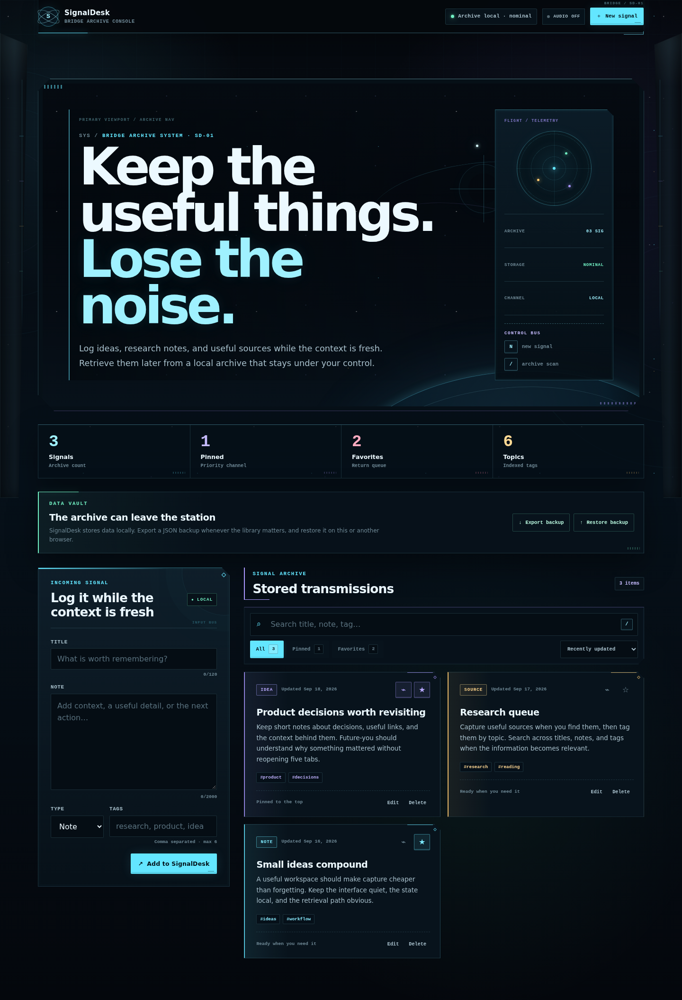
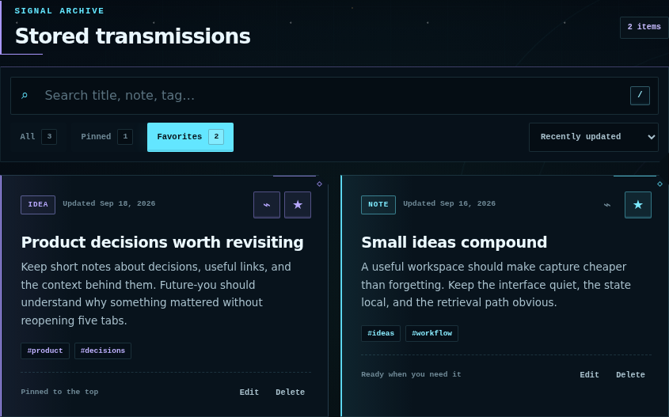
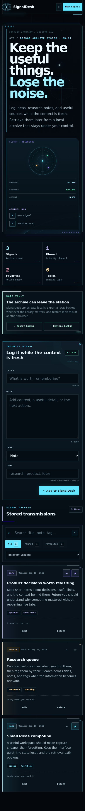

# SignalDesk

A local-first browser notebook for ideas, research notes, and useful links.

[**Open SignalDesk**](https://signaldesk-workspace.vercel.app/) · [Architecture notes](./ARCHITECTURE.md)



The point is not to collect more information. It is to make the useful thing easy to capture now — and easy to find again later.

```text
capture → tag → pin → search → revisit
```

## What goes into SignalDesk

Every signal is one of three things:

- **Note** — something worth remembering
- **Idea** — something worth developing
- **Link** — a useful source with context attached

A signal can have up to six normalized tags, be pinned, marked as a favorite, edited later, or removed with Undo.

Search runs across the title, body, type, and tags. The library can also be narrowed to pinned or favorite items and sorted by recent update, creation date, or title.

## Finding things again is the feature

SignalDesk keeps one canonical collection of signals.

Search results, filters, counts, pinned views, favorites, and sorting are derived from that collection rather than stored as parallel state. That keeps the retrieval path predictable: editing one signal does not leave another copy of the same state behind somewhere else.

The current library shows:

- total signals
- pinned signals
- favorites
- unique tags

Pinned items stay ahead of the rest of the selected sort order.

## The backup file has to earn its way in

Export produces a readable JSON file such as:

```text
signaldesk-backup-2026-09-28.json
```

Restore is stricter than export.

Before a backup can replace the current library, SignalDesk checks that:

- the file is valid JSON;
- it identifies itself as a SignalDesk backup;
- its backup version is supported;
- the payload contains an array of signals;
- every signal can be normalized;
- signal IDs are unique;
- the file is no larger than **5 MB**;
- the backup contains no more than **5,000 signals**.

A valid file is not applied immediately. SignalDesk first shows how many signals are about to be restored and makes it clear that the current library will be replaced.



## Local means local

The working library lives in browser `localStorage`.

The stored payload is versioned, and the loader also understands the earlier array-only format. Invalid stored data does not take down the interface; the app falls back to its starter library instead.

If the browser refuses storage writes, SignalDesk switches to a memory-only state and tells the user that persistence is unavailable. The UI remains usable for the current session, and JSON export is still available as the explicit portability path.

There is no account, server-side database, analytics SDK, or runtime API behind the core workflow.

## A small domain core

```text
React UI
   │
   ├── signal domain
   │     ├── normalization
   │     ├── reducer transitions
   │     ├── search / filter / sort
   │     └── derived counts
   │
   ├── browser storage
   │     └── versioned local payload
   │
   └── backup boundary
         ├── JSON export
         ├── validation
         └── confirmed restore
```

The domain functions do not depend on the DOM. Persistence and backup parsing sit behind separate boundaries, while the React layer handles interaction and presentation.

That is enough structure for this app: the interesting part is the behavior at the boundaries, not adding more layers.

## Desktop and mobile

<table>
  <tr>
    <td width="66%">
      
    </td>
    <td width="34%">
      
    </td>
  </tr>
</table>

The same workflow is available on small screens: capture, search, filters, editing, backup, and restore do not move into a separate mobile-only experience.

Keyboard shortcuts are also kept simple:

- `N` — jump to capture
- `/` — jump to search
- `Esc` — clear and leave search

Reduced-motion and forced-colors states are supported.

## Stack

**React 19.3 · Vite 8.3 · JavaScript · modern CSS · localStorage**

Verification uses:

- Vitest
- Playwright
- axe-core
- ESLint
- GitHub Actions

The browser suite exercises Chromium, mobile Chromium, Firefox, and WebKit flows including create, search, edit, delete/Undo, reload persistence, filters, backup/restore, blocked storage, accessibility, and horizontal overflow.

## Run locally

Requires Node.js 24+.

```bash
npm ci
npm run dev
```

For the static checks:

```bash
npm run check
```

For browser tests:

```bash
npx playwright install chromium firefox webkit
npm run test:e2e
```

## Where it came from

SignalDesk began as a small React exercise.

The useful part of rebuilding it was not making the CRUD screen larger. It was adding the pieces that change whether a local tool feels dependable: retrieval, normalization, versioned persistence, portable backups, restore validation, recovery states, keyboard use, responsive behavior, and browser-level checks.

It is still a small app. It just takes its data seriously.
